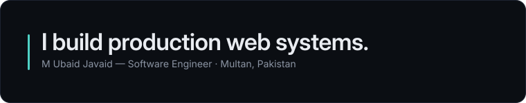
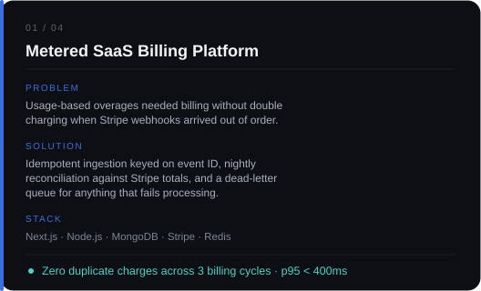
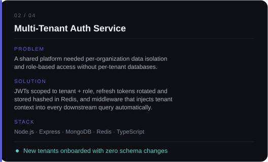
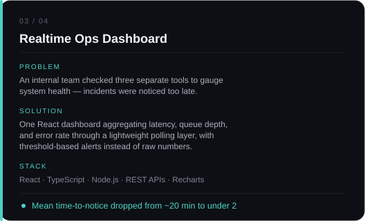
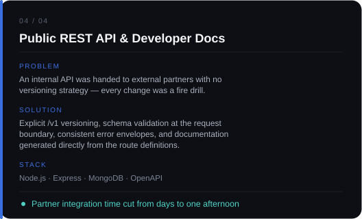
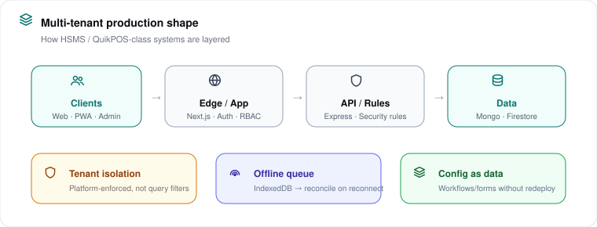
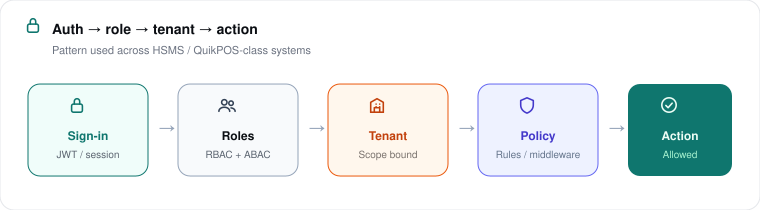
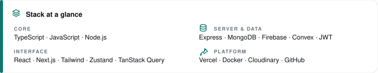

<!--
  SETUP — replace before publishing:
  · GitHub username used below: mubaidjavaid  (swap in yours for the two stat embeds)
  · Contact links in contact-strip.svg / footer-dark.svg are visual placeholders — wrap them
    in real <a href> tags around the  in this file once you have the URLs.
  · Everything else renders straight from /assets — no external hosting, no build step.
-->

<picture>
  <source media="(prefers-color-scheme: dark)" srcset="./assets/hero-dark.svg">
  <source media="(prefers-color-scheme: light)" srcset="./assets/hero-light.svg">
  
</picture>

  

 

 

## Philosophy

> Software is a liability the moment it ships. The job is to make sure it's a liability worth carrying — readable, testable, and boring in the parts that should be boring.

I build full-stack products end to end: schema design, API contracts, auth, billing, and the UI layer that sits on top of all of it. My interest isn't in using every tool available — it's in choosing the smallest set of tools that solves the problem correctly and stays maintainable eighteen months later.

Three things guide most of my decisions:

<table>
<tr>
<td width="33%" valign="top">

**Correctness before speed**
Fast software that returns wrong data is worse than slow software that doesn't ship. I optimize the second time, not the first.

</td>
<td width="33%" valign="top">

**Boundaries over cleverness**
Clear module boundaries and typed contracts outlast clever one-off abstractions. TypeScript is a design tool, not a linter.

</td>
<td width="33%" valign="top">

**Operate what you build**
Code that isn't monitored isn't finished. Logging, alerting, and rollback paths are part of the feature, not an afterthought.

</td>
</tr>
</table>

 

## About

I'm a full-stack engineer specializing in the MERN stack, with a focus on the systems that sit underneath a product's surface — authentication, subscription billing, rate-limited APIs, and the data models that have to hold up once real users start writing to them.

Most of my work falls into one of three categories:

- **SaaS foundations** — multi-tenant auth, role-based access, subscription and metered billing, webhooks that don't silently drop events.
- **API design** — REST services with explicit versioning, input validation at the boundary, and predictable error shapes.
- **Interface engineering** — React and Next.js front ends where state management and data-fetching strategy are decided before the first component is written, not after the third refactor.

I read incident reports and postmortems from engineering teams the way some people read tech blogs — the failure modes are usually more instructive than the success stories.

 

## Experience

<table>
<tr>
<td width="90" valign="top"><b>2024 — Now</b></td>
<td>

**Full-Stack Engineer — Independent / Contract**
Design and build SaaS backends and dashboards for early-stage products: authentication systems, Stripe-based billing, and REST APIs consumed by React front ends. Own projects from data model through deployment.

</td>
</tr>
<tr>
<td width="90" valign="top"><b>2022 — 2024</b></td>
<td>

**Full-Stack Developer — MERN Applications**
Built and shipped production features across the MERN stack: authentication flows, admin dashboards, and third-party API integrations. Focused on reducing response times and cutting redundant database calls in high-traffic endpoints.

</td>
</tr>
<tr>
<td width="90" valign="top"><b>Earlier</b></td>
<td>

**Foundations**
Started with vanilla JavaScript and PHP, moved into React and Node as the ecosystem matured. Spent a disproportionate amount of that time reading source code of libraries I depended on — it remains the fastest way I know to actually understand a tool.

</td>
</tr>
</table>

 

 

 

 

## Architecture

 

 

 

## Engineering Principles

- **Types are contracts, not paperwork.** If a shape can be wrong at runtime, it should be impossible at compile time.
- **A migration you can't reverse isn't a migration.** Every schema change ships with a rollback path before it ships with a feature.
- **Errors are part of the API.** A 500 with no context is a debugging tax charged to whoever's on call.
- **Cache invalidation is a design decision, made early.** Not a patch applied after the first stale-data bug report.
- **Tests describe behavior, not implementation.** A refactor shouldn't break a test suite that the feature itself didn't break.

 

 

  

 

 

## Current Focus

| | |
|---|---|
| **Building** | Usage-based billing patterns that stay correct under webhook replay and network partition |
| **Deepening** | System design for multi-tenant SaaS at scale — sharding, tenant isolation, and read/write splitting |
| **Exploring** | Edge runtimes for authentication middleware to cut cold-start latency on serverless deployments |
| **Reading** | Postmortems and incident retrospectives from infrastructure teams — the failure modes teach faster than the docs |

 

Every visual above is a real, editable SVG in <code>/assets</code> — no screenshots, no external image hosting.

