<!--
  GitHub profile README — Product Engineer
  Path hero + careful SVG system. Text + real links remain source of truth.
-->

  <picture>
    <source media="(prefers-color-scheme: dark)" srcset="./assets/hero-dark.svg">
    <source media="(prefers-color-scheme: light)" srcset="./assets/hero-light.svg">
    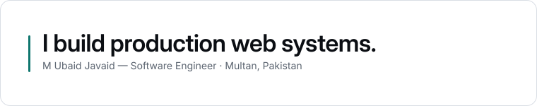
  </picture>

 

# M Ubaid Javaid

**Software Engineer — full-stack (MERN / Next.js)** · Multan, Pakistan

I build production web systems: multi-tenant SaaS, operational dashboards, and the APIs and data models underneath them. Currently at **Evolvo Technologies**, shipping client products across fintech, healthcare, prop trading and real estate.

  
  &nbsp;
  
  &nbsp;
  
  &nbsp;
  
  &nbsp;
  

  

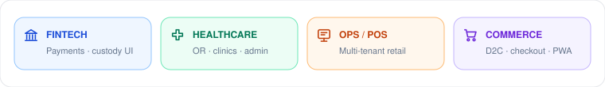

 

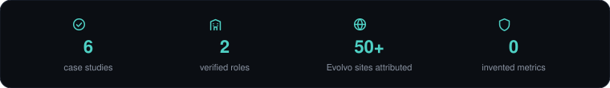

<picture>
  <source media="(prefers-color-scheme: dark)" srcset="./assets/divider-dark.svg">
  
</picture>

## Selected work

Each card links to a written case study — architecture, trade-offs, and what I'd do differently.

<table>
  <tr>
    <td width="50%">
      <a href="https://mubaidjavaid.vercel.app/projects/hsms-housing-society-management">
        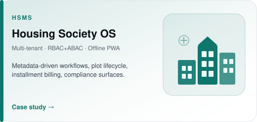
      </a>
    </td>
    <td width="50%">
      <a href="https://mubaidjavaid.vercel.app/projects/quikpos-saas-point-of-sale">
        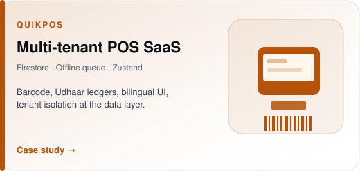
      </a>
    </td>
  </tr>
  <tr>
    <td width="50%">
      <a href="https://mubaidjavaid.vercel.app/projects/naaz-wears-ecommerce">
        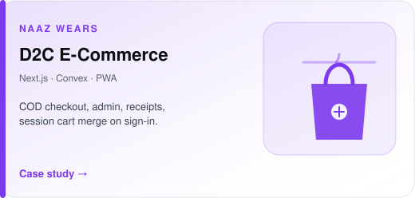
      </a>
    </td>
    <td width="50%">
      <a href="https://mubaidjavaid.vercel.app/projects/apex-platinum-fintech-platform">
        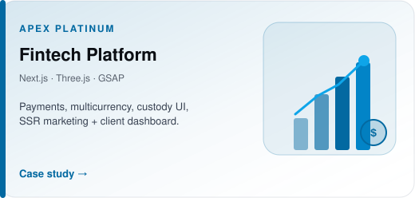
      </a>
    </td>
  </tr>
</table>

### HSMS — Housing Society Management System

Multi-tenant platform for housing-society operations: plot lifecycle, installment billing, visitor management, and compliance workflows. Workflows, forms and business rules live in the database rather than in code. Hybrid RBAC + ABAC, JWT auth, offline-first PWA.

`Next.js` `Express` `MongoDB` `PWA` — [Case study](https://mubaidjavaid.vercel.app/projects/hsms-housing-society-management)

Independent product-engineering case study — not a claim of client ownership.

### QuikPOS — Multi-Tenant Point-of-Sale SaaS

Cloud POS: barcode scanning, credit ledgers, bilingual surfaces. Tenant isolation at the data layer; offline queue reconciles on reconnect. Domain stores instead of one global client state.

`React` `Vite` `Firebase` `Zustand` — [Live](https://pos-saas-kappa.vercel.app) · [Case study](https://mubaidjavaid.vercel.app/projects/quikpos-saas-point-of-sale)

Independent product-engineering case study — multi-tenant POS patterns from production delivery.

### Naaz Wears — D2C E-Commerce

Production storefront: catalog, checkout, tracking, admin, receipts. SEO pages server-rendered; Convex for data/auth/functions; session carts merge on sign-in.

`Next.js` `React` `Convex` `Cloudinary` `PWA` — [Live](https://naazwears.vercel.app) · [Case study](https://mubaidjavaid.vercel.app/projects/naaz-wears-ecommerce)

Independent product-engineering case study — not a claim of store ownership.

### Apex Platinum — Fintech Platform

Institutional portal: payment flows, multicurrency, custody visualisation. SSR marketing + client dashboard; heavy visuals via dynamic imports.

`Next.js` `React` `TypeScript` `Three.js` `GSAP` — [Live](https://apex-platinum.vercel.app) · [Case study](https://mubaidjavaid.vercel.app/projects/apex-platinum-fintech-platform)

Production fintech delivery case study — not a claim of product ownership.

### Evolvo Technologies — client delivery

Built as part of my role — not product ownership.

<table>
  <tr>
    <td width="50%">
      <a href="https://surgi-core-opal.vercel.app">
        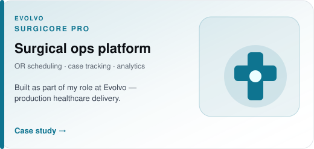
      </a>
    </td>
    <td width="50%">
      <a href="https://vitalis-health-indol.vercel.app">
        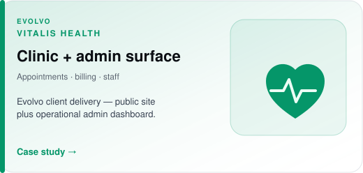
      </a>
    </td>
  </tr>
</table>

[SurgiCore case study](https://mubaidjavaid.vercel.app/projects/surgicore-pro-surgical-management) · [Vitalis case study](https://mubaidjavaid.vercel.app/projects/vitalis-health-healthcare-platform) · **[50+ Evolvo gallery](https://mubaidjavaid.vercel.app/projects#evolvo)**

<picture>
  <source media="(prefers-color-scheme: dark)" srcset="./assets/divider-dark.svg">
  
</picture>

## System shape

 

 

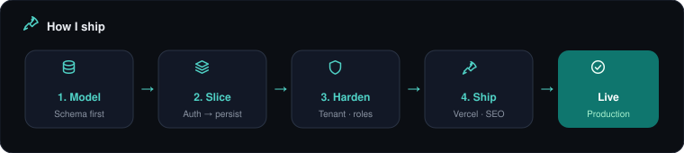

<picture>
  <source media="(prefers-color-scheme: dark)" srcset="./assets/divider-dark.svg">
  
</picture>

## Stack

- **Core** — TypeScript, JavaScript, Node.js  
- **Interface** — React, Next.js, Tailwind CSS, shadcn/ui, Zustand, TanStack Query, Framer Motion  
- **Server & data** — Express, MongoDB, Firebase/Firestore, Convex, REST APIs, JWT  
- **Platform** — Vercel, Docker, Cloudinary, Git, GitHub  

<picture>
  <source media="(prefers-color-scheme: dark)" srcset="./assets/divider-dark.svg">
  
</picture>

## Experience

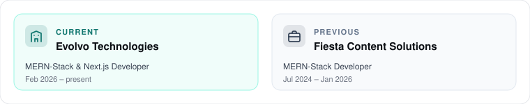

 

**Evolvo Technologies** — MERN-Stack & Next.js Developer · Feb 2026 – present  

Production web products for client brands across fintech, healthcare, prop trading and real estate. SSR, SEO, and Vercel deploys across multi-domain launches.

**Fiesta Content Solutions** — MERN-Stack Developer · Jul 2024 – Jan 2026  

MERN end to end: React interfaces, Express REST APIs, MongoDB schema design, auth and authorisation.

<picture>
  <source media="(prefers-color-scheme: dark)" srcset="./assets/divider-dark.svg">
  
</picture>

## How I work

- **Decide the data model first.** Most “frontend” pain started as a rushed schema.
- **Tenant boundaries belong in the platform, not the query.** Rules and middleware outlive memory.
- **Ship a vertical slice before a broad one.** Auth → persisted outcome beats five half-built features.

## Writing

<a href="https://mubaidjavaid.vercel.app/blog">
  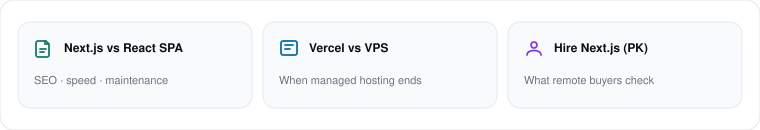
</a>

- [Next.js vs React SPA for a business website](https://mubaidjavaid.vercel.app/blog/nextjs-vs-react-spa-business-website)  
- [Vercel vs VPS for a Next.js SaaS](https://mubaidjavaid.vercel.app/blog/vercel-vs-vps-for-nextjs-saas)  
- [Hiring a freelance Next.js developer in Pakistan](https://mubaidjavaid.vercel.app/blog/freelance-nextjs-developer-pakistan)  

<picture>
  <source media="(prefers-color-scheme: dark)" srcset="./assets/divider-dark.svg">
  
</picture>

## Contact

 

  
  &nbsp;
  
  &nbsp;
  

Open to freelance, contract and full-time. Send the shape of the problem — I'll tell you honestly if I'm the right person.

**[mubaidjavaid97@gmail.com](mailto:mubaidjavaid97@gmail.com)** · [LinkedIn](https://www.linkedin.com/in/m-ubaid-javaid-260735407) · [Portfolio](https://mubaidjavaid.vercel.app)
